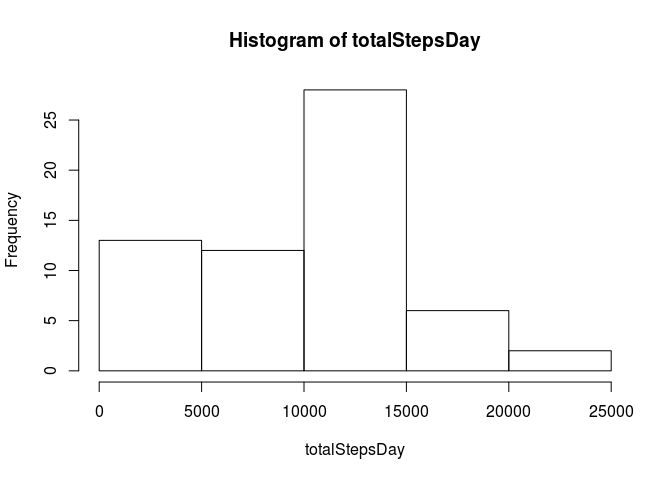
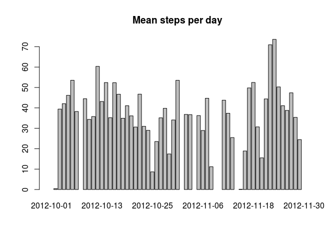
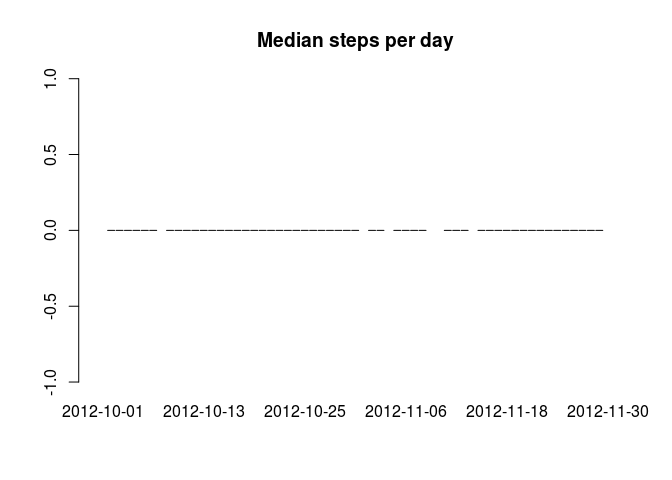
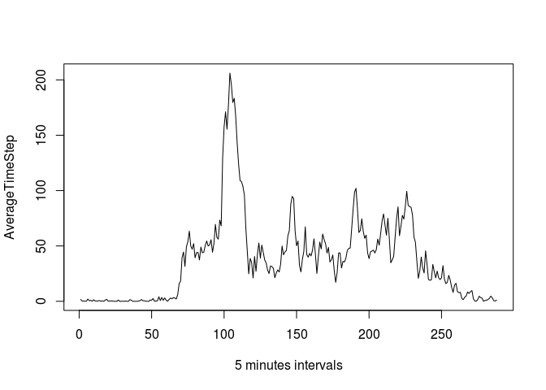
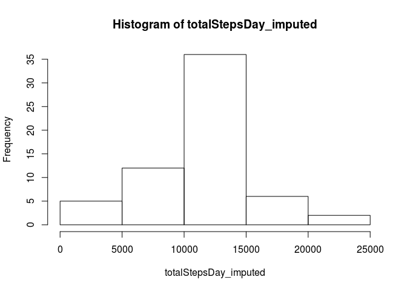
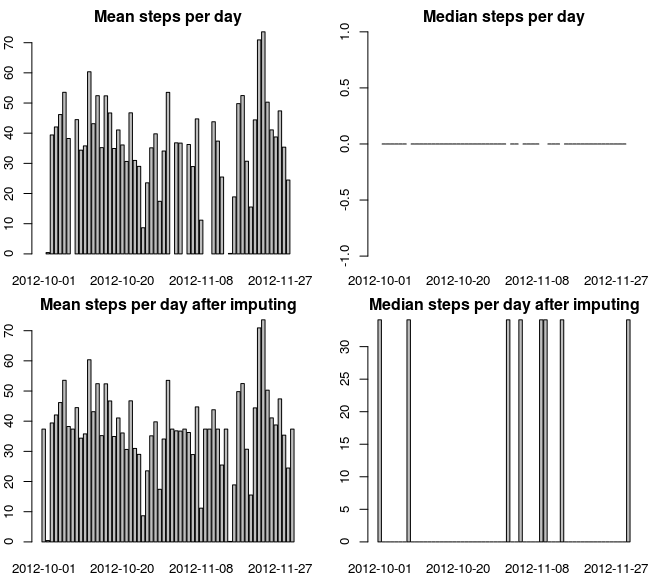
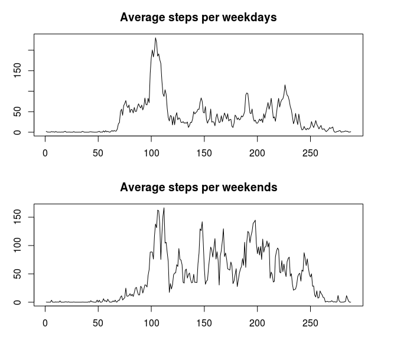

## Loading and preprocessing the data

```r
actdf <- read.csv("activity.csv")
actdf$date <- as.Date(actdf$date) #convert date column to date type
```
==================================================================================

##Histogram for total steps taken each day

```r
totalStepsDay <- tapply(actdf$steps,actdf$date, sum, na.rm = TRUE)
hist(totalStepsDay)
```

<!-- -->
==================================================================================

## Mean and median number of steps taken each day

```r
MeanStepsDay <- tapply(actdf$steps,actdf$date, mean, na.rm = TRUE)
MedianStepsDay <- tapply(actdf$steps,actdf$date, median, na.rm = TRUE)
```

### What is mean total number of steps taken per day?

```r
barplot(MeanStepsDay, main = "Mean steps per day")
```

<!-- -->

### What is median total number of steps taken per day?

```r
barplot(MedianStepsDay, main = "Median steps per day")
```

<!-- -->
==================================================================================

## What is the average daily activity pattern?

```r
AverageTimeStep <-  tapply(actdf$steps,actdf$interval, mean, na.rm = TRUE)
plot(AverageTimeStep, type='l', xlab = "5 minutes intervals")
```

<!-- -->

```r
MaxAverage = as.numeric(which.max(AverageTimeStep))
MaxInterval= names(which.max(AverageTimeStep))
```
### max average value = 104 and this of the time interval = 835

==================================================================================

## Imputing missing values

```r
missing_rows = sum(is.na(actdf$steps))
missing_ratio = missing_rows/ length (actdf$steps)
```
###missing values size
there are number of missing values in the dataset = 2304.
the ratio of missing valus = 0.1311475.

###imputing stratgy
imputing missing values by insert average value of  mean for that 5-minute interval, and keep the results in actImputeddf


```r
actImputeddf <- actdf
for(index  in 1: length(actImputeddf$steps)) {
  if( is.na(actImputeddf$steps[index])) {
    averageIndex <- as.character(actImputeddf$interval[index]) # get the interval id
    actImputeddf$steps[index] <-  as.numeric(AverageTimeStep[averageIndex]) # set value wz average
     }
}
```
##Histogram of the total number of steps taken each day after missing values are imputed

```r
totalStepsDay_imputed <- tapply(actImputeddf$steps,actImputeddf$date, sum, na.rm = TRUE)
hist(totalStepsDay_imputed)
```

<!-- -->

## Mean and median number of steps taken each day after imputing

```r
MeanStepsDay_imp <- tapply(actImputeddf$steps,actImputeddf$date, mean, na.rm = TRUE)
MedianStepsDay_imp <- tapply(actImputeddf$steps,actImputeddf$date, median, na.rm = TRUE)
```

###  mean and median total number of steps taken per day before and after imputing and clear increase in values

```r
par(mfcol = c(2,2), mar = c(2,2,2,2))
barplot(MeanStepsDay, main = "Mean steps per day")
barplot(MeanStepsDay_imp, main = "Mean steps per day after imputing")
barplot(MedianStepsDay, main = "Median steps per day")
barplot(MedianStepsDay_imp, main = "Median steps per day after imputing")
```

<!-- -->

==================================================================================

## Are there differences in activity patterns between weekdays and weekends?
###we will go to answer this question as follow
**Processing to get the difference**  
adding new column to the data with two levels weekday and weekend

```r
actImputeddf$Day <- weekdays(actImputeddf$date)
for(index  in 1: length(actImputeddf$Day)) {
  if( actImputeddf$Day[index] == "Saturday" |  actImputeddf$Day[index] == "Sunday") {
    actImputeddf$Day[index] = "Weekend"
  }
  else
  {
    actImputeddf$Day[index] = "Weekday"
  }
}
```

**Drawing the difference** 
Draw average steps per weekdays against average steps per weekends

```r
actWeekDays <- actImputeddf[actImputeddf$Day == "Weekday",]
weekdayaver <-  tapply(actWeekDays$steps,actWeekDays$interval, mean, na.rm = TRUE)
actWeekends <- actImputeddf[actImputeddf$Day == "Weekend",]
weekendaver <-  tapply(actWeekends$steps,actWeekends$interval, mean, na.rm = TRUE)
par(mfrow = c(2:1), mar = c(3,3,3,3))
plot(weekdayaver, type='l', main = "Average steps per weekdays")
plot(weekendaver, type='l', main = "Average steps per weekends")
```

<!-- -->
